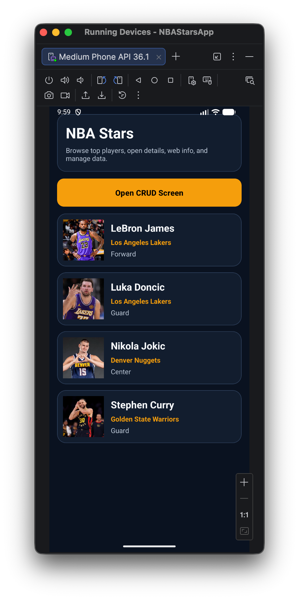
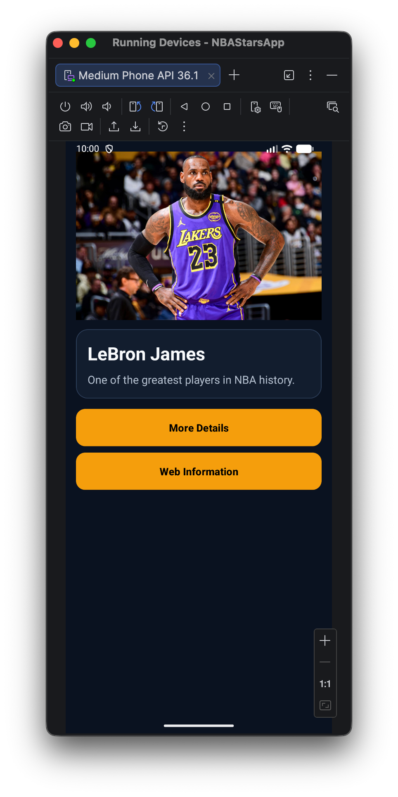
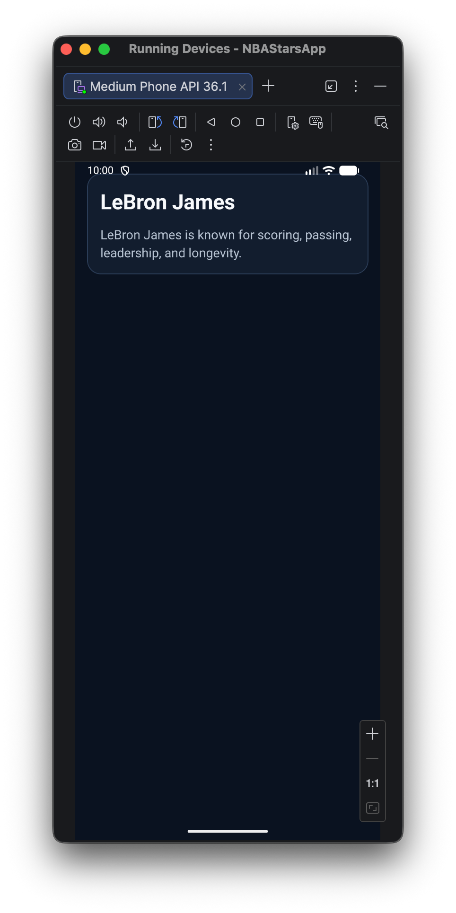
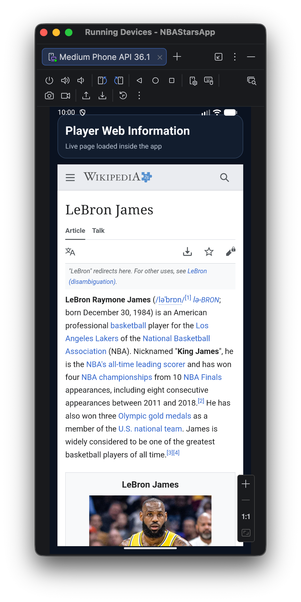

# NBA Stars App

> An Android application built in Java that presents NBA players through multiple activities, local database storage, WebView integration, and full CRUD operations.

## 1. Description and Objectives

This project is an Android Studio application developed for a university assignment focused on building a multi-activity app.

The application presents a list of NBA stars and allows the user to:
- view a customized list of players
- open a basic details screen with image and short text
- open a full details screen with more information
- open a web information screen inside the app
- perform CRUD operations on player data

### Main objectives
- practice Android development using Java
- understand activity navigation using Intents
- use a local Room database for persistent storage
- implement a customized RecyclerView list
- create a clean and coherent user interface

---

## 2. Features

- Customized list of NBA players using `RecyclerView`
- Player image, name, team, and position displayed in the main list
- Basic details screen
- Full details screen
- Web information screen using `WebView`
- Local database using `Room`
- Full CRUD operations:
  - Create
  - Read
  - Update
  - Delete

---

## 3. Application Structure

The app contains 5 main activities:

### Activity 1 - MainActivity
Displays the list of NBA stars in a custom RecyclerView.

### Activity 2 - PlayerBasicActivity
Displays:
- player image
- player name
- short description

### Activity 3 - PlayerFullActivity
Displays:
- player name
- full description

### Activity 4 - PlayerWebActivity
Displays web information about the selected player using WebView.

### Activity 5 - CrudActivity
Allows the user to:
- insert a new player
- update an existing player
- delete a player
- view current players stored in the local database

---

## 4. Technologies Used

- **Language:** Java
- **IDE:** Android Studio
- **UI:** XML layouts
- **Database:** Room
- **List Component:** RecyclerView
- **Web Content:** WebView
- **Platform:** Android

---

## 5. Data Model

The application uses a `Player` entity stored in a local Room database.

### Player fields
- `id`
- `name`
- `team`
- `position`
- `shortDescription`
- `fullDescription`
- `imageName`
- `webUrl`

---

## 6. Project Packages

```text
com.example.nbastarsapp
├── adapter
│   └── PlayerAdapter.java
├── data
│   ├── AppDatabase.java
│   ├── DatabaseProvider.java
│   └── PlayerDao.java
├── model
│   └── Player.java
├── MainActivity.java
├── PlayerBasicActivity.java
├── PlayerFullActivity.java
├── PlayerWebActivity.java
└── CrudActivity.java
```

## 7. Screenshots

### Main Screen
Shows the customized list of NBA players and access to the CRUD screen.



### Basic Details Screen
Shows the player image, name, short description, and navigation buttons.



### Full Details Screen
Shows a more detailed description of the selected player.



### Web Information Screen
Shows the selected player's webpage inside the app using WebView.


